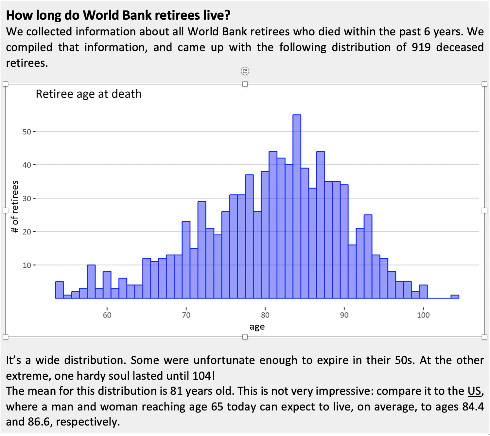

## Critique

The chart presented above shows the histogram for the age at which the World Bank retirees die within last 6 years. The choice of the graph is appropriate as it’s a simple plot and the message can be communicated easily with non-technical audience. The sample size is pretty decent covering over 900 retirees. It’s definitely a peculiar dataset to start with. My first comment after reading the chart would be that the two data points author talks about (in their 50s and 104) are probable outliers so should not be relevant to any analysis about life expectancy of WB retirees. Second, the author makes an argument about mean age of the distribution being lower than average mortality age of men and women in US. I assume that the data is from all World Bank employees which includes country office staff as well. It would be a bit absurd to compare the average life expectancy of an employee from Ghana to that of a person living in the US. The socio-economic factors that contribute to mortality between these countries is significantly different making the comparison between them worthless. It would have been more meaningful if the analysis took only the HQ staff and compared that with the national averages. Third, the graph comprises of all WB employees irrespective of their gender. Comparing the mean from a mixed group to gender specific averages would give inconclusive results. To make this chart better, I would divide the data into gender groups and create either a stacked bar graph or two histograms on the same plot with varying transparency and colors. Additionally, gender ratio of World Bank (worldwide) could be potentially very different than that of the US population and hence these two numbers are not comparable. The author talks about average age at death of those men and women reaching 65, now this is an Expected value - E\[X|given they have reached 65] which can't be compared to an overall expected value (81 in this case). Lastly, the cause of death doesn’t necessarily correlate well with age. A 17-year-old person is as likely to die from a plane crash as a 75-year-old. Some more information on the cause of death would have made a stronger argument. In addition to that, some readily available stats like standard deviation and median age would have helped in gathering better insights from the graph. Also, outliers in the data (for instance the retiree passing away at 104) can be better represented by box plot which gives better representation of how far data points are from majority of the data points (i.e. the mean).

In conclusion, the chart lacks in data representation and no clear assessment can be made. The text below is based on incomparable data so making such statements would be wrong. 
 
